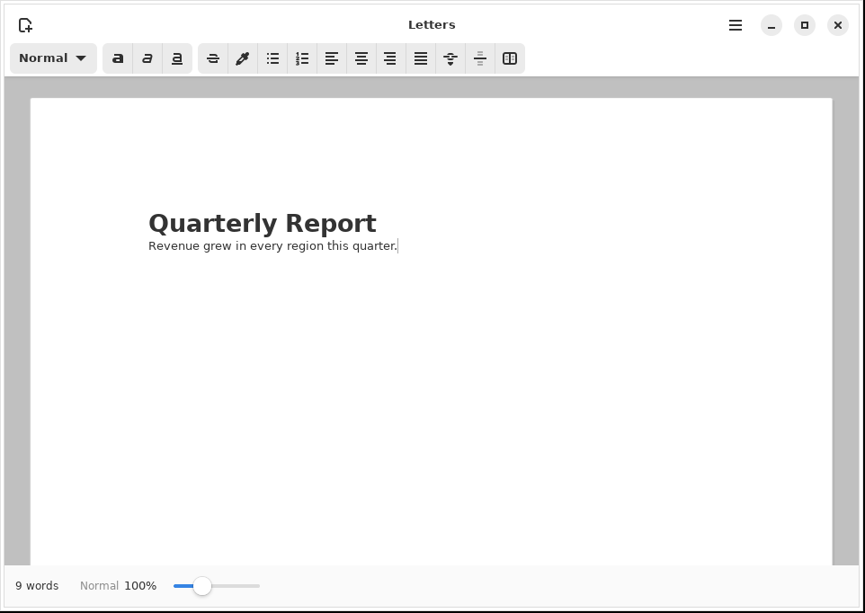
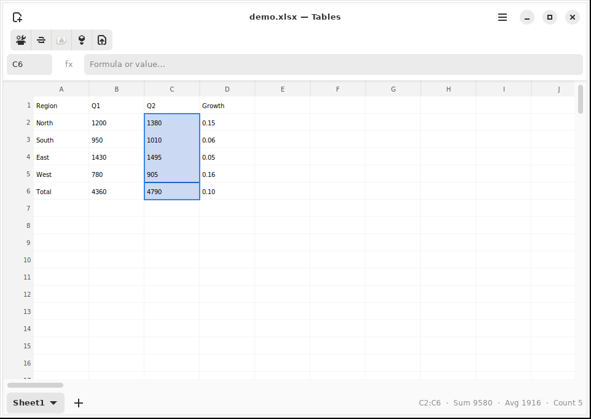
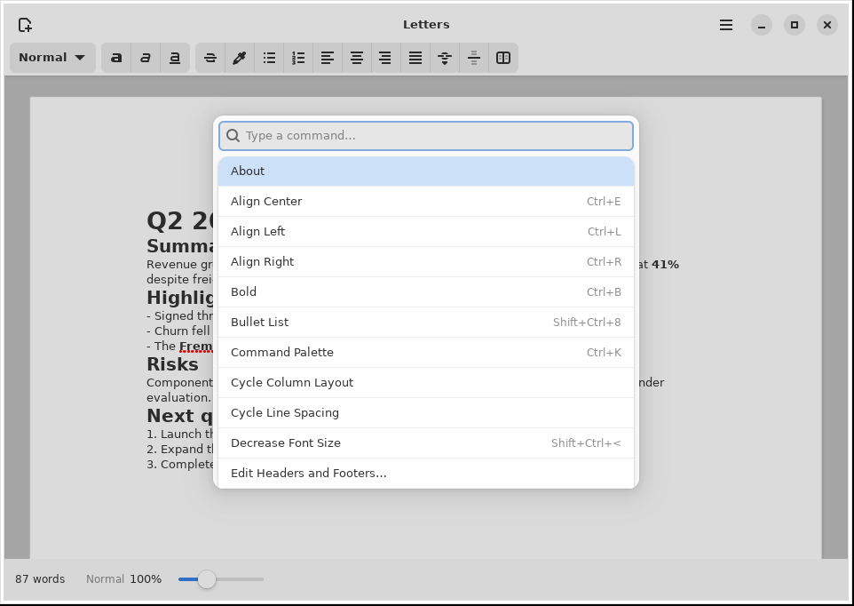
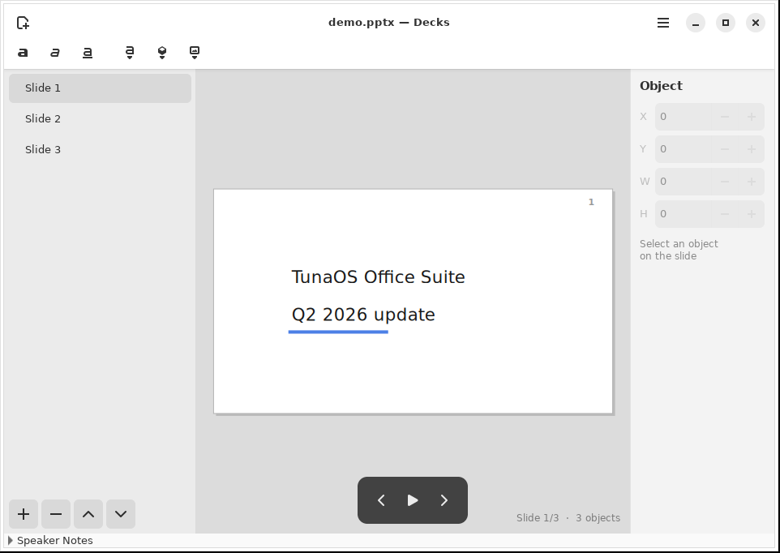

# GTK Office Suite — GNOME-Native Office Suite in Rust

[](https://github.com/tuna-os/gtk-office-suite/actions/workflows/ci.yml)

A LibreOffice-inspired office suite written in Rust with GTK4 and libadwaita, shipped as Flatpaks.

**Three apps:** Letters (word processor), Tables (spreadsheet), Decks (presentations).  
**Stack:** Rust + gtk4-rs 0.11 + libadwaita 0.9 + GNOME 50 runtime.  
**Status:** post-v1.0 — measured LibreOffice parity (ratcheted corpora: CommonMark 630/652, LO-Letters 109/109, LO-Decks 9/9, OpenFormula 107/107), Ctrl+K command palette, and per-app live status surfaces. See [docs/PARITY.md](docs/PARITY.md) for the feature-by-feature truth table.

---

## Screenshots

Captured automatically from the real apps by the
[Screenshots workflow](.github/workflows/screenshots.yml)
(`tests/gui/walkthrough.py` drives each app under Xvfb).

| Letters | Tables |
|---|---|
|  |  |

| Command palette (Ctrl+K) | Decks |
|---|---|
|  |  |

---

## Quick Start

```bash
# Build all three apps
cargo check --workspace

# Run individual apps (requires GTK4 dev libraries)
cargo run -p letters
cargo run -p tables
cargo run -p decks

# Run tests
cargo test -p tables
cargo test -p suite-common

# Build Flatpaks (on Bluefin host with Flatpak Builder)
flatpak run org.flatpak.Builder --state-dir=.flatpak-builder build-dir flatpak/org.tunaos.letters-rust.json
```

---

## Architecture

```
gtk-office-suite/
├── suite-common/        # Shared crate (mapped to LibreOffice's svl/ layer)
│   └── src/
│       ├── undo.rs      # Generic Command<T> + UndoManager<T>
│       ├── format.rs    # NumberFormat engine (currency, date, percent, etc.)
│       ├── events.rs    # Broadcaster<H> + Listener<H> typed events
│       ├── file_dialogs.rs
│       └── toast_manager.rs
├── letters/             # Word processor
├── tables/              # Spreadsheet
├── decks/               # Presentations
├── flatpak/             # Flatpak manifests, metainfo, icons, GSettings
└── docs/                # Architecture, research, contributing guides
```

### LibreOffice Architecture Mapping

| LO Shared Layer | Our Equivalent | File |
|-----------------|---------------|------|
| `svl/undo.hxx` — SfxUndoAction, SfxUndoManager | `Command<T>`, `UndoManager<T>` | `suite-common/src/undo.rs` |
| `svl/numformat.hxx` — SvNumberFormatter | `NumberFormat`, `NumberFormatKind` | `suite-common/src/format.rs` |
| `svl/SfxBroadcaster.hxx` — SfxBroadcaster, SfxListener | `Broadcaster<H>`, `Listener<H>` | `suite-common/src/events.rs` |
| `editeng/borderline.hxx` — SvxBorderLineStyle | `CellBorder`, `BorderStyle` | `tables/src/window.rs` |
| LO source for reference | `/var/home/james/dev/libreoffice-core/` | Sparse checkout: `sc/`, `sd/`, `svl/`, `editeng/` |

---

## Reference Repositories

| Project | Path | Purpose |
|---------|------|---------|
| **LibreOffice core** | `/var/home/james/dev/libreoffice-core/` | Full feature catalogs, architecture, undo/number-format/border patterns |
| **IronCalc** | `/var/home/james/dev/ironcalc-ref/` | Spreadsheet engine used in Tables |
| **Rnote** | `https://github.com/flxzt/rnote` | Rust/GTK4 canvas drawing, undo/redo, selection patterns |
| **Loupe** | `https://gitlab.gnome.org/GNOME/loupe` | GNOME image viewer — Cairo, DrawingArea, fullscreen, gestures |
| **Papers** | `https://gitlab.gnome.org/GNOME/papers` | GNOME document viewer — find sidebar, search box |
| **gnome-gui-spec** | `https://github.com/hanthor/gnome-gui-spec` | GNOME HIG patterns, Blueprint/XML examples |

---

## Crates and Dependencies

### External (leveraged, not reinvented)

| Crate | Used In | Purpose |
|-------|---------|---------|
| `ironcalc_base` | Tables | Formula engine (83 functions) |
| `calamine` | Tables | XLSX, XLS, ODS reader |
| `rust_xlsxwriter` | Tables | XLSX writer |
| `pulldown-cmark` | Letters | Markdown parser |
| `rdocx` | Letters | DOCX native read/write |
| `num-format` | suite-common | Locale-aware number formatting |
| `chrono` | suite-common | Date parsing/formatting |
| `quick-xml` | Decks | OpenXML XML parsing/writing |
| `zip` | Decks | PPTX ZIP packaging |
| `image` | Decks | JPEG/WebP/GIF decoding |
| `zspell` | Letters | Spell checking |
| `pangocairo` | Tables, Letters | Text measurement, rendering |
| `regex` | Tables | Data validation patterns |

### Internal (our crates)

| Crate | Purpose |
|-------|---------|
| `suite-common` | Shared undo, format, events, file dialogs, toast manager |

---

## GNOME HIG Compliance

| Requirement | Implementation |
|-------------|---------------|
| **Window chrome** | `AdwApplicationWindow` + `AdwToolbarView` + `AdwHeaderBar` |
| **Adaptive layout** | `AdwBreakpoint` at 600sp, `AdwOverlaySplitView` for sidebars |
| **Empty states** | `AdwStatusPage` via `suite_common::make_empty_state()` |
| **Preferences** | `GSettings` schemas with `connect_changed` bindings |
| **Keyboard shortcuts** | App actions registered, Ctrl+Z undo in Tables/Decks |
| **Dark mode** | `AdwStyleManager` system preference + manual toggle |
| **Toast feedback** | `AdwToast` for save/error notifications |
| **Spacing/margins** | 6/12/18/24px scale per GNOME HIG token system |
| **Icon naming** | Symbolic icons (`-symbolic` suffix) from GNOME icon set |

---

## Feature Status

### Letters (Word Processor)
- ✅ Tabbed documents (AdwTabView)
- ✅ Rich text formatting (B/I/U/S/H, H1-H6, Code, Blockquote) with a selection popover and live style readout
- ✅ Markdown macros (type `**bold**` → auto-format)
- ✅ Find & Replace, spell check
- ✅ DOCX/Markdown/ODT/HTML/PDF/TXT I/O — page geometry, font family, headers/footers round-trip, LibreOffice-oracle-verified
- ✅ Page layout, zoom, opt-in ruler, columns, line spacing
- ✅ Auto-save, undo/redo, drag-and-drop images

### Tables (Spreadsheet)
- ✅ Cairo grid with per-column widths
- ✅ IronCalc formula engine (SUM, CONCAT, 83 functions)
- ✅ XLSX/ODS/CSV import, XLSX export
- ✅ Multi-sheet tabs, sort, borders, freeze panes
- ✅ Number formatting (currency, date, percent, scientific)
- ✅ Cell merge, data validation, chart dialog
- ✅ Range selection (mouse, Shift+arrows) with live Sum/Avg/Count; name box + Ctrl+G Go to Cell
- ✅ Column resize via drag, double-click auto-fit
- ✅ Undo/redo (CellEdit, Sort, Format, Border, Merge, Freeze commands)

### Decks (Presentations)
- ✅ Cairo slide canvas with shapes, images, text
- ✅ PPTX read/write via zip + OpenXML
- ✅ Slide sidebar, slide management (add/delete/reorder)
- ✅ Fullscreen present mode with keyboard navigation
- ✅ Object drag with snap-to-grid
- ✅ Slide transitions (PushLeft, Fade, Wipe, Cover, Split)
- ✅ Speaker notes pane, inline text editing
- ✅ Object inspector (position/size), presenter pill, live slide/object status
- ✅ Undo/redo (AddObject, DeleteObject, MoveObject, ChangeText, etc.)

### suite-common (Shared Infrastructure)
- ✅ Ctrl+K command palette over the GioAction registry (all three apps; coverage-tested)
- ✅ Keyboard shortcuts dialog (Ctrl+?) generated from the same registry
- ✅ Generic undo/redo (`Command<T>` + `UndoManager<T>`)
- ✅ Number format engine (`NumberFormat`, Excel serial dates)
- ✅ Event broadcaster/listener (`Broadcaster<H>`)
- ✅ File dialog helpers, toast manager
- ✅ Style system, property pool, search, print, unit conversion (suite-common-core)

---

## Conventions

### Code Structure
- Per-app `window.rs` should stay under ~600 lines (refactor into modules when exceeding)
- Rendering code in `canvas.rs` (Decks) or inline in `draw_grid` (Tables)
- UI components in own files: `toolbar.rs`, `sidebar.rs`
- Undo commands per-app in `undo.rs` implementing `suite_common::undo::Command<T>`

### Rust Patterns
- Use `Rc<RefCell<>>` for shared state in GTK callbacks
- Use `Rc<Cell<>>` for simple Copy-able values shared across closures
- Clone `Rc` explicitly for each closure — avoid Copy confusion
- Prefer `gesture.connect_*(move |...| { ... })` for GTK event handling

### Testing
- Test data model code in `engine.rs` and `format.rs` (pure Rust, no GTK)
- Window-level tests require GTK4 runtime — run on build machine (`himachal`)
- Use `cargo check` for fast feedback; `cargo test` on the build machine

---

## Links

- **Roadmap:** [docs/ROADMAP.md](docs/ROADMAP.md)
- **GitHub:** https://github.com/tuna-os/gtk-office-suite
- **Release:** https://github.com/tuna-os/gtk-office-suite/releases/tag/v1.0
- **GNOME HIG:** https://developer.gnome.org/hig/
- **gtk4-rs docs:** https://gtk-rs.org/gtk4-rs/stable/latest/docs/gtk4/
- **LibreOffice reference:** `/var/home/james/dev/libreoffice-core/`

## License

GPL-3.0-or-later. All source files carry SPDX headers; the core crates on
crates.io (suite-common-core, suite-export, tables-core) are published
under the same license.
