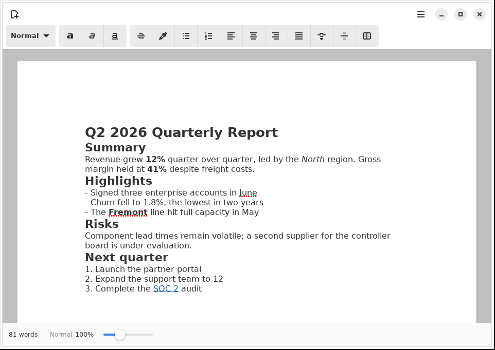
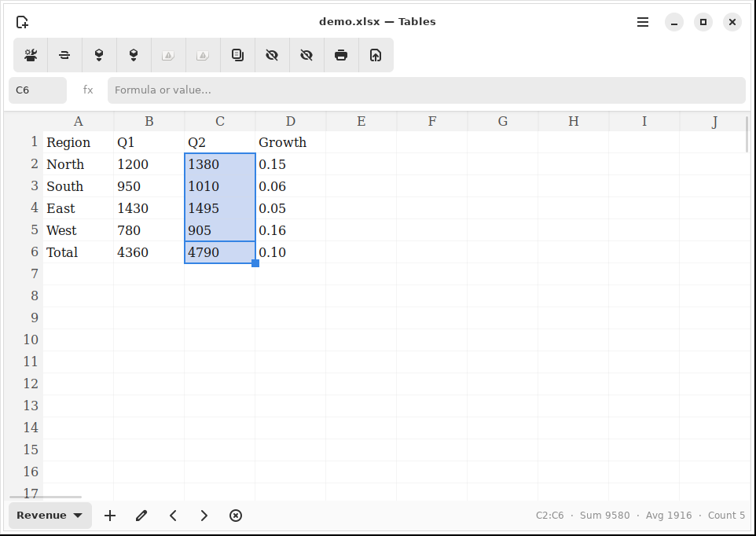
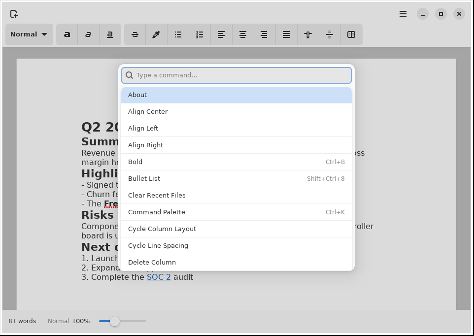
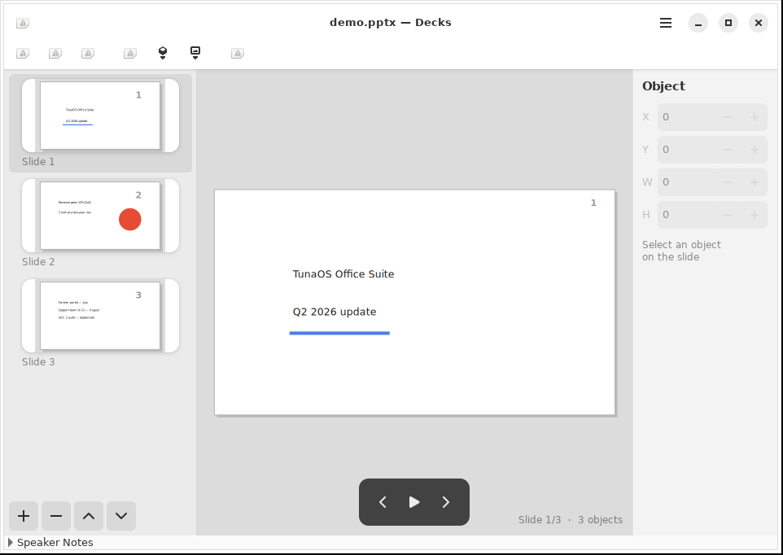

# GTK Office Suite

[](https://github.com/tuna-os/gtk-office-suite/actions/workflows/ci.yml)

Three GNOME-native office applications written in Rust with GTK4 and
libadwaita, shipped as Flatpaks:

| App | What it is | Reads | Writes |
|---|---|---|---|
| **Letters** | Word processor | DOCX, ODT, Markdown, TXT | DOCX, ODT, Markdown, HTML, PDF, TXT |
| **Tables** | Spreadsheet | XLSX, XLS, ODS, CSV, TSV | XLSX, PDF |
| **Decks** | Presentations | PPTX, ODP | PPTX, ODP, PDF |

CSV and TSV are import-only in Tables, on purpose: saving a spreadsheet
over an imported `.csv` would write XLSX bytes to a file everything else
reads as text, so Save As offers `.xlsx` instead.

They are not a LibreOffice port. Each app has its own document model in a
GTK-free `*-core` crate, and compatibility with other office software is
measured against real LibreOffice output rather than asserted — see
[Project status](#project-status).

---

## Screenshots

Captured automatically from the real applications by the
[Screenshots workflow](.github/workflows/screenshots.yml), which drives
each app under Xvfb. Nothing here is a mockup.

| Letters | Tables |
|---|---|
|  |  |

| Command palette (Ctrl+K) | Decks |
|---|---|
|  |  |

---

## Install

The applications are published as Flatpaks from the TunaOS repository:

```bash
flatpak remote-add --if-not-exists tuna-os \
    https://tunaos.org/flatpak/tuna-os.flatpakrepo
flatpak install tuna-os org.tunaos.letters org.tunaos.tables org.tunaos.decks
```

Then launch them from your application menu, or:

```bash
flatpak run org.tunaos.letters
```

Flathub submission is prepared but **not yet submitted** — the remaining
steps need a human and are written down in
[flathub/README.md](flathub/README.md).

---

## Project status

Current release: **[v2.1.0](https://github.com/tuna-os/gtk-office-suite/releases/latest)**.
All three apps are usable for real work. What that does and does not mean:

**Measured compatibility.** Four corpora are ratcheted in CI — the pass
count may climb, never fall:

| Corpus | Score | What it checks |
|---|---|---|
| CommonMark 0.31.2 | 651 / 652 | Every spec example round-trips idempotently through Letters' model |
| LibreOffice ↔ Letters | 109 / 109 | Documents survive a real LibreOffice Writer pass |
| LibreOffice ↔ Decks | 9 / 9 | Decks survive a real LibreOffice Impress pass |
| OpenFormula | 107 / 107 | Formula evaluation against the ODF spec's own cases |

These use **LibreOffice itself as an oracle**, not a hand-written
expectation of what it would do. A missing oracle is a failure in the
required lanes, never "observed compatibility". Feature-by-feature detail
is in [docs/PARITY.md](docs/PARITY.md).

**Current focus: crashes and flakiness, not features.** The work in
[docs/readiness-2026-09/](docs/readiness-2026-09/README.md) is a
September readiness push. The honest summary is that it keeps finding real
defects — seeded command-sequence campaigns run nightly against all three
document models, recorded GUI journeys run on every pull request, and
every package reader is bounded against hostile input. Each of those
landed because the instrument found something, and each readiness document
marks what is **not** done rather than rounding up.

Where this is going next: [ROADMAP.md](ROADMAP.md).

---

## Build from source

You need Rust and the GTK4 + libadwaita development libraries
(gtk4-rs 0.11, libadwaita 0.9, targeting the GNOME 50 runtime).

```bash
cargo check --workspace      # fast — no linking
cargo run -p letters         # or -p tables, -p decks
cargo test --workspace
```

A [justfile](justfile) wraps the common loops:

```bash
just setup        # create the toolbox container with the build dependencies
just preflight    # check + lint + test, the same gates CI runs
just test-gui-all # the AT-SPI GUI journeys, inside the toolbox
```

### Nix

A [flake](flake.nix) gets you running without installing GTK development
libraries yourself:

```bash
nix run .            # Letters
nix run . -- tables  # letters | tables | decks
nix develop          # dev shell with Rust + GTK4/libadwaita
nix build            # all three apps plus desktop/schema/icon files
```

`nix develop` points `GSETTINGS_SCHEMA_DIR` at `flatpak/`, so
`cargo run -p letters` works immediately.

Two crates (IronCalc, rdocx) are pinned to git revisions and fetched with
`allowBuiltinFetchGit`, so no dependency hashes need maintaining.
**`flake.lock` is not committed** — run `nix flake lock` on a Nix machine
to pin nixpkgs and commit the result.

### Flatpak

```bash
flatpak run org.flatpak.Builder --state-dir=.flatpak-builder \
    build-dir flatpak/org.tunaos.letters.json
```

---

## How the code is organised

Every app is split in two: a **`*-core` crate with no GTK dependency**
holding the document model and file formats, and a thin GTK binary on top.
That split is what makes the document models testable without a display,
and it is where most of the test suite lives.

| Crate | GTK? | What lives there |
|---|---|---|
| `letters-core`, `tables-core`, `decks-core` | no | Document models, file readers and writers, undo commands |
| `letters`, `tables`, `decks` | yes | Windows, widgets, Cairo rendering, actions |
| `suite-common-core` | no | Shared primitives: undo, number formats, styles, search, atomic saves, autosave |
| `suite-common` | yes | Shared widgets: command palette, file dialogs, toasts |
| `suite-export` | no | PDF export |

Other directories: `tests/` (GUI journeys and Python harness tests),
`interop/` (the reviewable interoperability corpus), `fuzz/` (cargo-fuzz
targets), `flatpak/` and `flathub/` (packaging), `docs/`, `po/`
(translations).

For module layout, data flow, the LibreOffice patterns this borrows from,
and the dependency inventory, see
**[docs/ARCHITECTURE.md](docs/ARCHITECTURE.md)**.

---

## Testing

Tests are layered, and the layers answer different questions:

| Layer | Command | Question it answers |
|---|---|---|
| Unit and model | `cargo test --workspace` | Does the document model do the right thing? |
| Property and round-trip | part of the above | Does write → read return what went in? |
| LibreOffice oracle | `REQUIRE_SOFFICE=1 cargo test` | Does other software agree? |
| Stateful campaigns | `cargo test -- --ignored seed_campaign` | Does a long random command sequence break an invariant? |
| GUI journeys | `just test-gui-all` | Does the application actually do it, on a real display? |

The GUI journeys drive the real applications through AT-SPI under Xvfb in a
container, and can record what they did: add the `verify-video` label to a
pull request and the recorded clips are written into its description. See
[docs/GUI-TESTING-SPEC.md](docs/GUI-TESTING-SPEC.md) and
[docs/CI-VIDEO-EVIDENCE.md](docs/CI-VIDEO-EVIDENCE.md).

The oracle suites need LibreOffice Writer and Impress installed; without
them they fail rather than silently skip, so a green run means the oracle
really ran.

---

## Contributing

Start with [docs/CONTRIBUTING.md](docs/CONTRIBUTING.md) — it covers the
Rust/GTK patterns this codebase uses, commit style, module size limits and
the pre-commit gates. [AGENTS.md](AGENTS.md) is the instruction set for
automated contributors.

Good first things to look at:

- Open issues labelled for the current readiness push in
  [docs/readiness-2026-09/](docs/readiness-2026-09/README.md) — each
  document lists what is still open, with reproductions.
- `docs/PARITY.md` rows that are not yet green.

File bug reports and feature requests in this repository. If you are coming
from the deprecated Python applications, see the
[deprecation and migration roadmap](docs/PYTHON-DEPRECATION.md).

---

## Documentation

| Document | What it covers |
|---|---|
| [docs/ARCHITECTURE.md](docs/ARCHITECTURE.md) | Workspace layout, module structure, data flow, dependencies |
| [docs/CONTRIBUTING.md](docs/CONTRIBUTING.md) | Conventions, workflow, pitfalls |
| [docs/DEVELOPMENT.md](docs/DEVELOPMENT.md) | Environment setup |
| [docs/GNOME-GUIDELINES.md](docs/GNOME-GUIDELINES.md) | HIG compliance rules and widget patterns |
| [docs/PARITY.md](docs/PARITY.md) | Feature-by-feature compatibility truth table |
| [docs/TESTING.md](docs/TESTING.md), [docs/TEST-PLAN.md](docs/TEST-PLAN.md) | Test strategy |
| [docs/GUI-TESTING-SPEC.md](docs/GUI-TESTING-SPEC.md) | The AT-SPI journey harness |
| [docs/CI-QUALITY-GATES.md](docs/CI-QUALITY-GATES.md) | What CI enforces and why |
| [docs/readiness-2026-09/](docs/readiness-2026-09/README.md) | Current readiness work, item by item |
| [docs/RELEASE.md](docs/RELEASE.md) | Release process |
| [docs/adr/](docs/adr/) | Architecture decision records |
| [CHANGELOG.md](CHANGELOG.md) | What changed when |

---

## License

GPL-3.0-or-later. All source files carry SPDX headers. The GTK-free core
crates published on crates.io (`suite-common-core`, `suite-export`,
`tables-core`) are under the same license.
