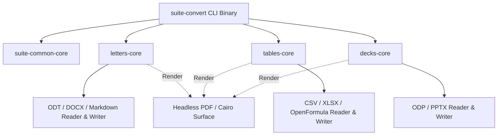

# Headless Document Conversion CLI & Batch Export Architecture Specification

**Last updated**: 2026-09-11 | **Maintainer**: strategist agent (tuna-os hive)

---

## Strategic Objective

The GTK Office Suite architecture explicitly requires keeping all business logic, document modeling, format parsing, and rendering engines GTK-free in dedicated core crates (`suite-common-core`, `letters-core`, `tables-core`, `decks-core`).

While GTK4/libadwaita applications (`letters`, `tables`, `decks`) provide the interactive GUI experience, enterprise production environments, server-side document automation pipelines, and CI validation runners require headless command-line execution.

This document establishes the architecture, command-line interface specification, and implementation strategy for headless conversion binaries (`suite-convert`) and app-specific conversion utilities (`letters-convert`, `tables-convert`, `decks-convert`).

---

## Key Requirements

1. **GTK-Free Execution**: Headless conversion binaries MUST compile and execute without linking or initializing GTK4, libadwaita, GDK, Cairo display backends, or requiring an X11/Wayland display server or Xvfb framebuffers.
2. **Streaming and Batch Operation**: Support single-file input/output conversion, batch directory scanning with glob filters, and STDIN/STDOUT piping for UNIX shell composability.
3. **Loss Budget Inspection**: Support `--inspect` / `--json` flags to evaluate format conversion fidelity loss without writing output files (interoperability loss budget analysis).
4. **Deterministic Exit Codes**:
   - `0`: Successful conversion / inspection.
   - `1`: Parsing or syntax error in source document.
   - `2`: Unsupported format feature or loss threshold exceeded (`--fail-on-loss`).
   - `3`: Input/output I/O or filesystem error.

---

## CLI Interface Specification

```text
Usage: suite-convert [OPTIONS] <INPUT> [OUTPUT]

Arguments:
  <INPUT>   Input document path (ODT, DOCX, CommonMark, ODP, PPTX, CSV, XLSX, OpenFormula) or '-' for STDIN
  [OUTPUT]  Output document path (PDF, ODT, DOCX, CommonMark, HTML, PNG) or '-' for STDOUT

Options:
  -f, --from <FORMAT>        Explicitly specify input format [odt, docx, md, odp, pptx, csv, xlsx]
  -t, --to <FORMAT>          Explicitly specify output format [pdf, odt, docx, md, odp, pptx, html, csv]
  -b, --batch <DIR>          Process all matching documents in target directory
      --glob <PATTERN>       Glob pattern for batch processing [default: "*"]
      --inspect              Perform non-destructive format inspection and exit
      --fail-on-loss <LEVEL> Fail with exit code 2 if loss level exceeds [minor, major, critical]
      --json                 Emit structured JSON diagnostics to STDOUT
  -v, --verbose              Enable detailed conversion log tracing
  -h, --help                 Print help information
  -V, --version              Print version information
```

---

## Technical Architecture & Crate Boundaries



### 1. Engine Extraction
Headless binaries link directly against `*-core` crates. Renders for format conversion (such as document layout to PDF) utilize headless Cairo surface contexts rather than GTK widget snapshot callers.

### 2. Performance & Memory Budgets
- **Startup Latency**: < 15ms target cold start (bypassing GTK GObject type initialization).
- **Throughput**: > 50 pages/sec conversion rate for standard ODT/DOCX documents.
- **Memory Footprint**: < 32MB peak RSS memory footprint per conversion process.

---

## Rollout Milestones

- **Phase 1 (Q4 2026)**: Implement `suite-convert` binary entry point under `crates/suite-convert` wrapping core parser/writer APIs.
- **Phase 2 (Q4 2026)**: Integrate headless PDF export pipeline using headless Cairo context surfaces across Letters and Decks.
- **Phase 3 (Q1 2027)**: Implement enterprise batch processing flags (`--batch`, `--fail-on-loss`) and Flatpak CLI entry-point wrappers.
