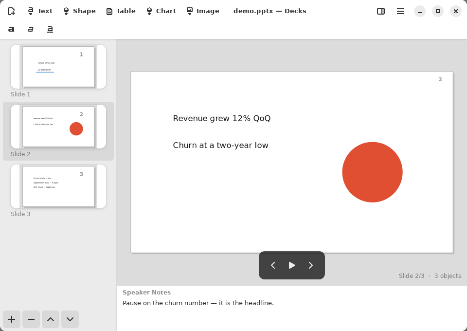
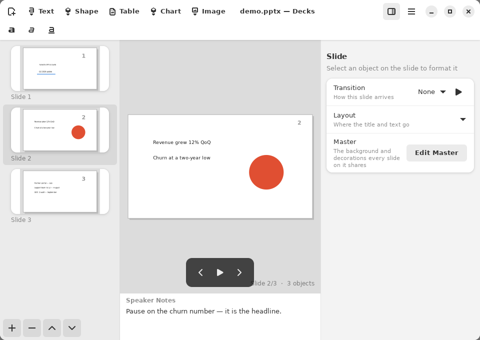
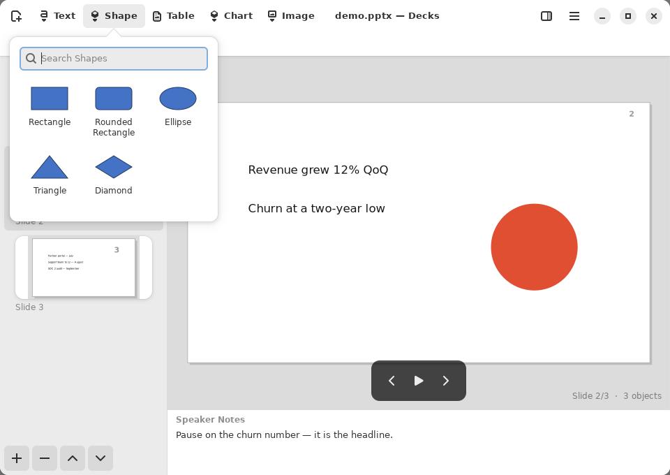
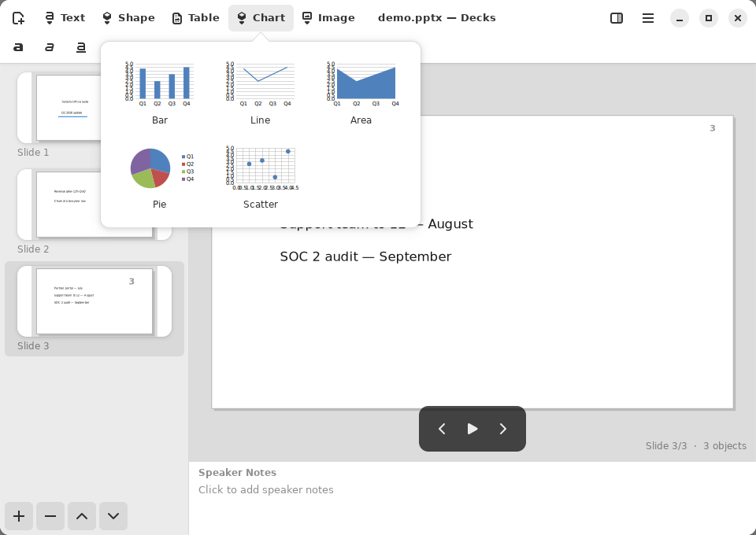
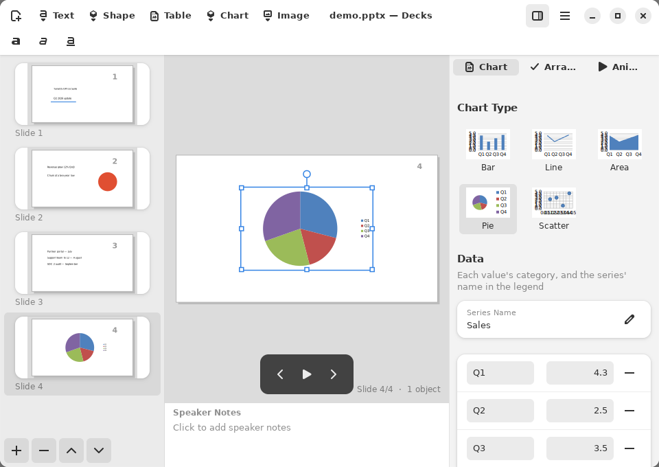
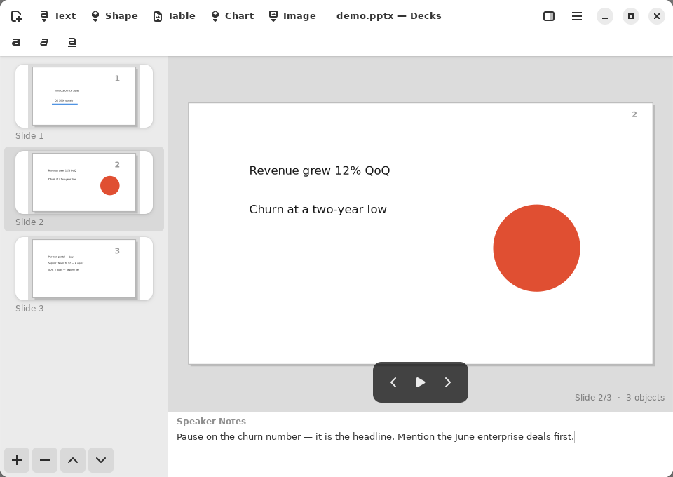
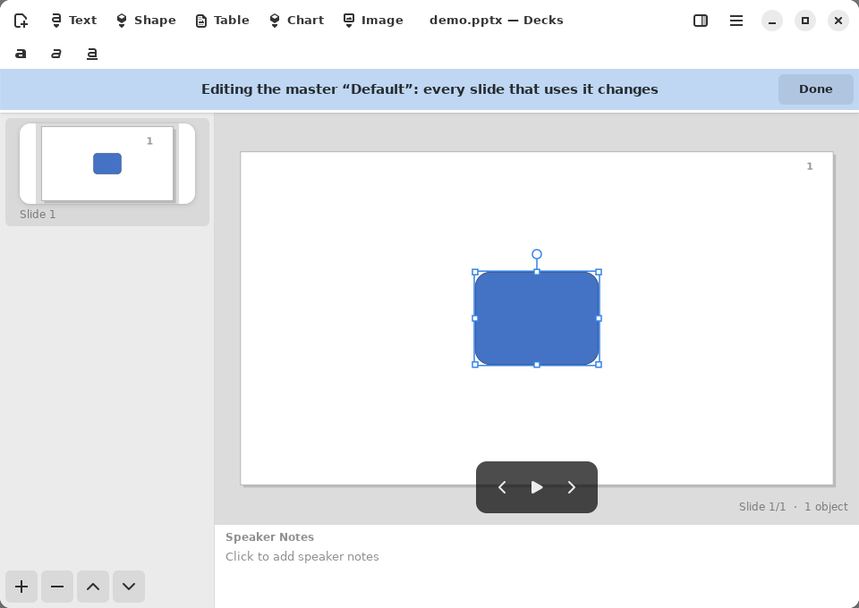
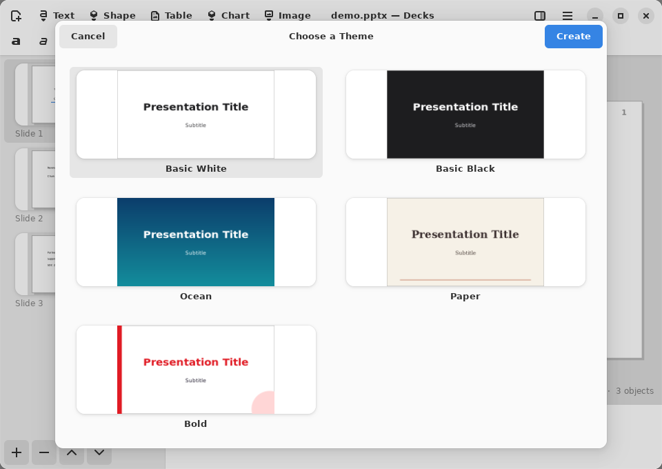
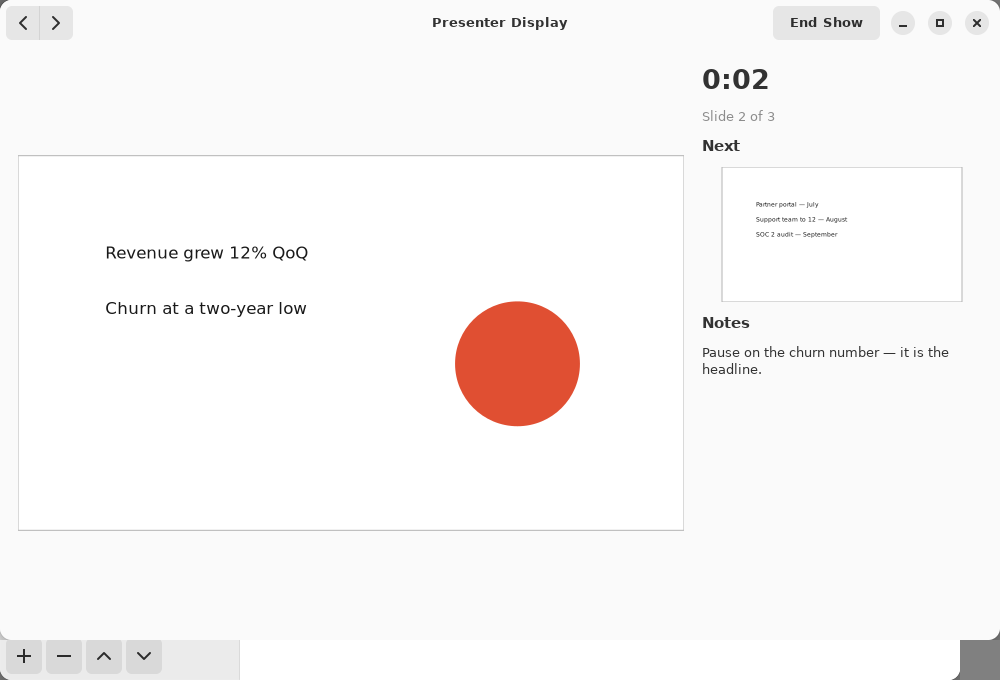
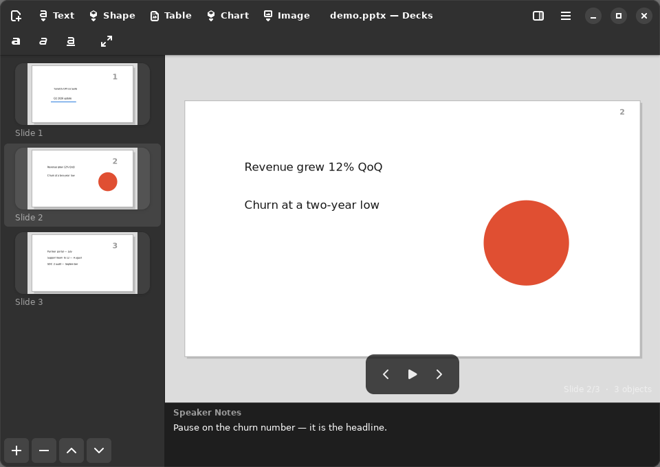

# Decks

Presentations. Opens PPTX and ODP; saves PPTX and ODP, and exports PDF,
handouts and PNG. Pre-alpha: see
[the README](../../README.md#project-status) before relying on it.

Every screenshot is of the running app, captured by
`tests/gui/feature_tour.py` ([how](README.md#how-the-screenshots-are-made)).

## The editor

*The editor: slide thumbnails, the slide, speaker notes, and the presenter controls.*

Slides are listed on the left; the buttons under the list add, delete and
reorder them. The slide is in the middle, its speaker notes under it, and
the pill at the bottom steps through slides and starts the show
(**F5**). The Insert buttons (Text, Shape, Table, Chart, Image) are in the
header bar. In a narrow window they fold into a single Insert menu.

## The Format sidebar

*The Format sidebar for a slide: its layout, background and transition.*

With nothing selected, the **Format** sidebar shows the slide: its
transition (with a preview button), its layout and its master. Choosing a
layout moves the title and text boxes to that layout's places, as one undo
step. With an object selected, the sidebar formats the object instead.

## Shapes

*Insert Shape: a searchable library, each shape drawn as it will appear.*

**Shape** opens the library, drawn by the same code that draws the slide.
Typing searches it straight away.

## Charts

*Insert Chart: each kind drawn with sample data before it is chosen.*

*A chart on a slide, its type and data edited in the Format sidebar.*

A chart's type and data are edited in the sidebar, each change one undo
step. It is saved as a real chart part that PowerPoint and Impress open
as their own chart.

## Speaker notes

*Speaker notes under each slide, saved with the deck.*

**Ctrl+Alt+Shift+S** moves to the notes. They are saved in PPTX and ODP,
and shown in the presenter view.

## Masters

*Edit Master: shapes and styles on the master appear on every slide that uses it.*

**Edit Master** (also in the Format sidebar) edits the master itself, with
a banner saying so. Anything placed on it appears on every slide that uses
it. **Done** returns to the slides.

## Themes

*New from Template: a theme chooser, each theme previewed.*

**Ctrl+Shift+N** starts a deck from a theme: Basic White, Basic Black,
Ocean, Paper or Bold.

## Presenting and rehearsing

*Rehearse: the presenter view with the current and next slide, notes and a clock.*

**Rehearse** opens the presenter view on its own: the current slide, the
next one, the notes and a running clock. **F5** presents: with a second
monitor the audience sees the slides there while the presenter view stays
on the laptop, and with one monitor the audience view is shown alone.

## Dark style

*Decks in the dark style.*

## Also in Decks

Without a screenshot of their own:

- **Text boxes**, **tables** and **images**, moved, resized and rotated
  on the canvas, each change one undo step.
- **Builds**: objects appear click by click during the show.
- **Export** as PDF, as handouts, or as PNG images.
- **Crash recovery**: unsaved work is snapshotted and offered back after a
  crash.

## Gaps these screenshots show

The screenshots show these problems as they are now. They are recorded
here rather than hidden:

- In the dark style, the area around the slide stays light grey, and the
  "Slide 2/3 · 3 objects" caption on it is almost unreadable.
- The axis labels in the chart-kind previews overlap at that size
  (Scatter most of all).
- The shape and chart Insert buttons share one generic icon.
- Real-world PPTX/ODP decks can look much worse than this demo; the
  [render parity roadmap](../RENDER-PARITY-ROADMAP.md) tracks that.
