# Letters

A word processor. Opens DOCX, ODT, Markdown and plain text; saves DOCX,
ODT, Markdown, HTML and plain text, and exports PDF. Pre-alpha: see
[the README](../../README.md#project-status) before relying on it.

Every screenshot is of the running app, captured by
`tests/gui/feature_tour.py` ([how](README.md#how-the-screenshots-are-made)).

## Writing in Print Layout

*A document in Print Layout: headings, emphasis, lists, a block quote and a link.*

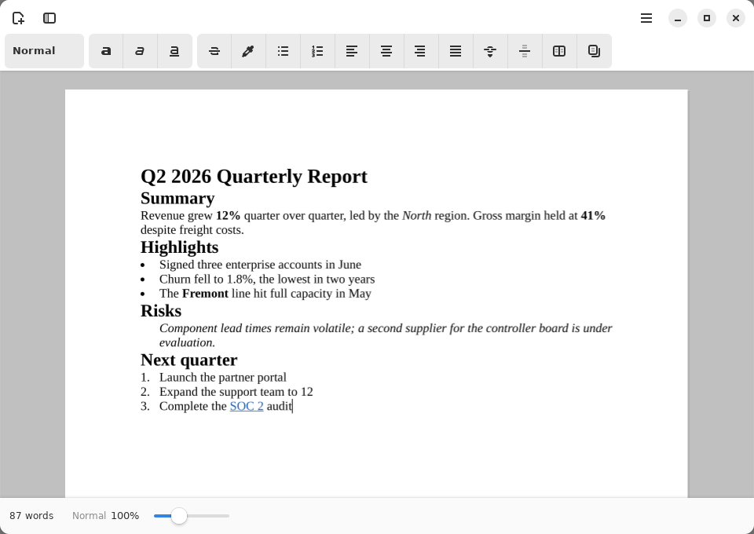

Print Layout is the default view: the document laid out on pages, edited in
place. The status bar shows the word count, the paragraph style at the
caret and the zoom. **Ctrl+B / Ctrl+I / Ctrl+U** set bold, italic and
underline; **Ctrl+Shift+8** and **Ctrl+Shift+7** start bullet and numbered
lists, and **Ctrl+]** / **Ctrl+[** indent and outdent them.

## Paragraph styles

*The paragraph-style picker, each style drawn as it will look on the page.*

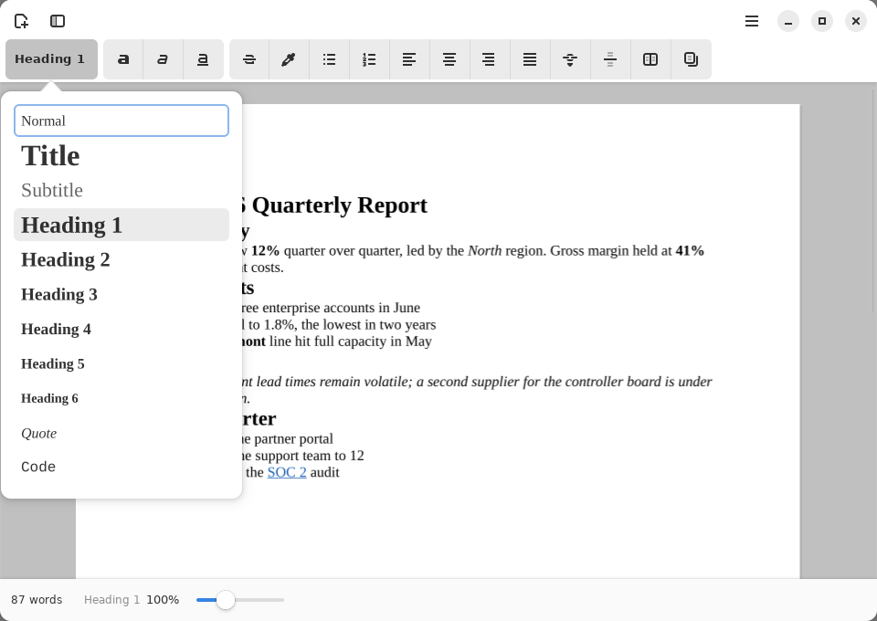

The first toolbar button names the style at the caret. It opens a list of
Normal, Title, Subtitle, Heading 1–6, Quote and Code, each drawn with the
same shaping the page uses. Choosing one restyles the selected paragraphs
as a single undo step. Every style is also in the command palette.

## Outline

*The outline sidebar lists the headings; choosing one moves to it.*

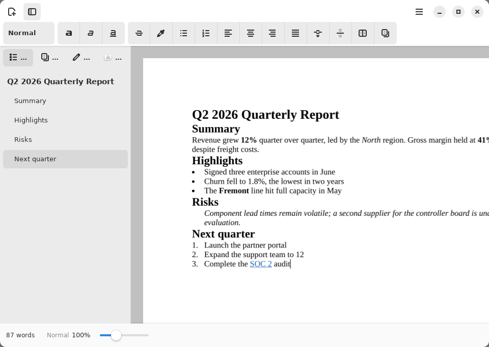

**Ctrl+Alt+O** opens the sidebar on the outline. Its other views are page
thumbnails (**Ctrl+Alt+P**), tracked changes (**Ctrl+Alt+R**) and comments
(**Ctrl+Shift+Alt+A**).

## Command palette

*Ctrl+K: every command, searchable by name, with its shortcut.*

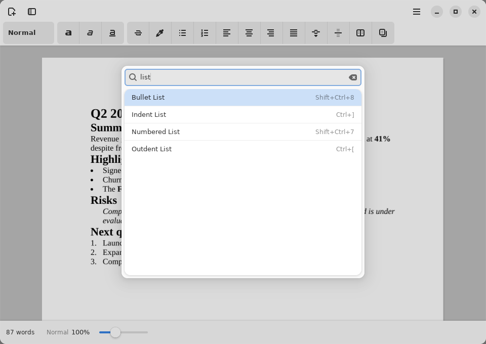

**Ctrl+K** lists every command the app has, including ones without a
toolbar button, and filters as you type. All three apps have it.

## Find and Replace

*Find and Replace, with every match highlighted in the document.*

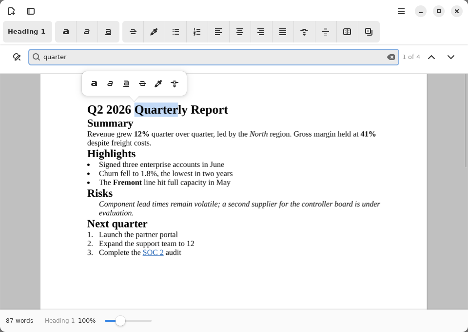

**Ctrl+F** opens the find bar over the page. It counts the matches and
steps through them with the arrows (or Enter / Shift+Enter).

## Track Changes

*Track Changes: insertions and deletions marked by author, reviewed in the sidebar.*

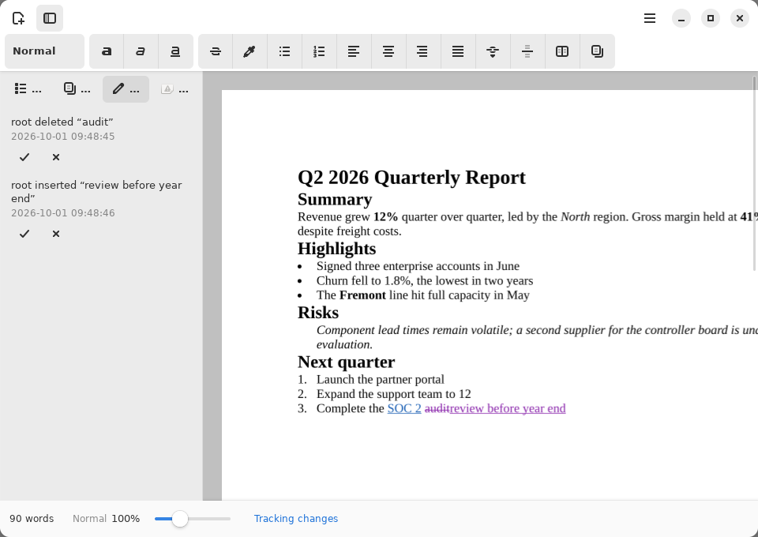

**Ctrl+Alt+T** turns tracking on; the status bar says so. Typed text is
marked as an insertion and deleted text stays, struck through, until the
deletion is accepted. The sidebar lists each change with its author and
time, and buttons to accept or reject it. Typing on from your own change
continues it as one change. Changes round-trip through DOCX (`w:ins` /
`w:del`) and ODT, checked against LibreOffice. The details are in
[LETTERS-REVIEW-WORKFLOWS.md](../LETTERS-REVIEW-WORKFLOWS.md).

## Comments

*Comments anchored to text, with replies and Resolve, in the Comments sidebar.*

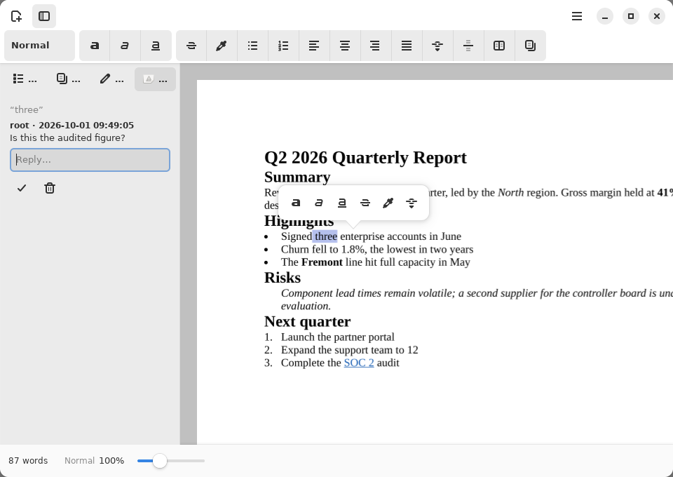

**Ctrl+Alt+M** comments on the selection, or on the word at the caret. The
Comments view lists each thread with its quoted text, a reply field,
Resolve and Delete. A comment stays attached to its text as the text is
edited, and round-trips through DOCX and ODT, replies and resolved state
included.

## Table of contents

*A table of contents generated from the headings, with page numbers.*

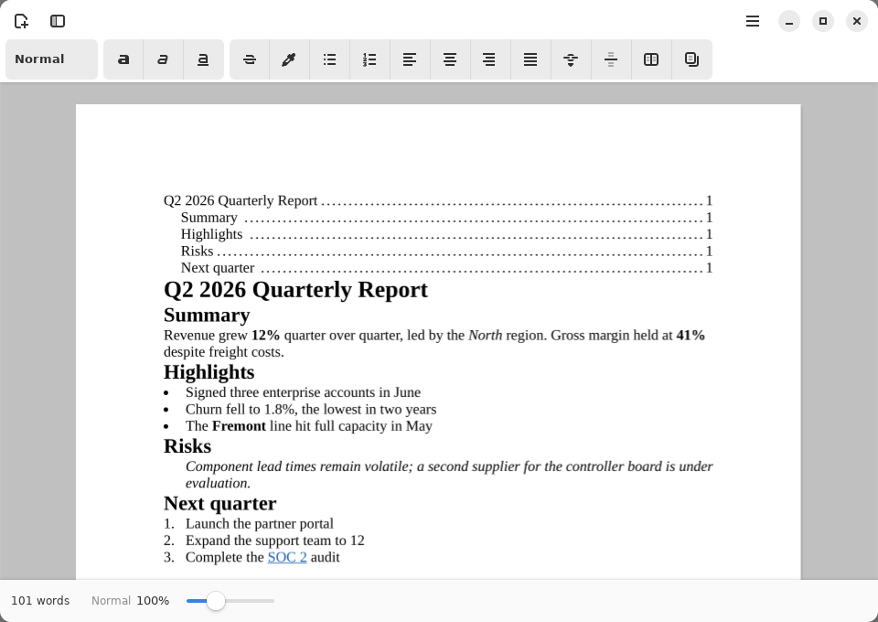

**Insert Table of Contents** (in the palette) builds one from the headings,
with dot leaders and the page each heading is on. **Update Table of
Contents** regenerates it. In DOCX it is a TOC field and in ODT an index,
so Word and LibreOffice can update it too.

## Smart chips

*Smart chips: "@" offers dates, people and links as inline objects.*

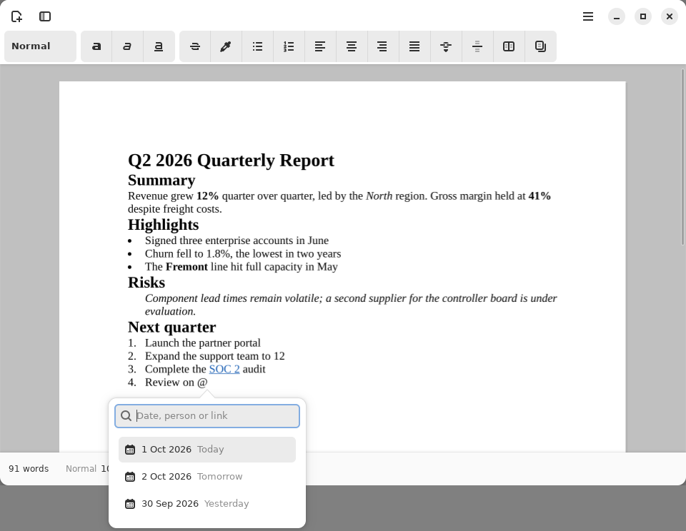

Typing **@** at the start of a word offers dates, people and links.
**Ctrl+Alt+C** offers them anywhere. The chosen chip is one inline object,
read out by its label, and inserting it is one undo step.

## Tables

*Insert Table puts a table at the caret; its cells are edited in place.*

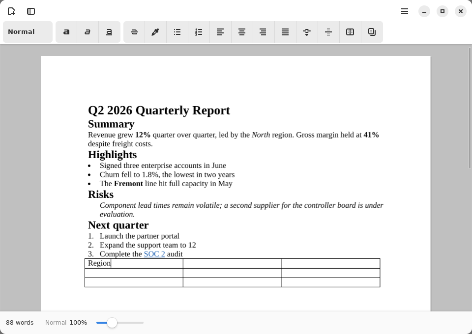

**Insert Table…** puts a 3×3 table at the caret. Rows and columns are added
or removed with the table commands in the palette (Insert Row Above/Below,
Insert Column Left/Right, Delete Row, Delete Column).

## Headers and footers

*Headers and footers, with page-number fields.*

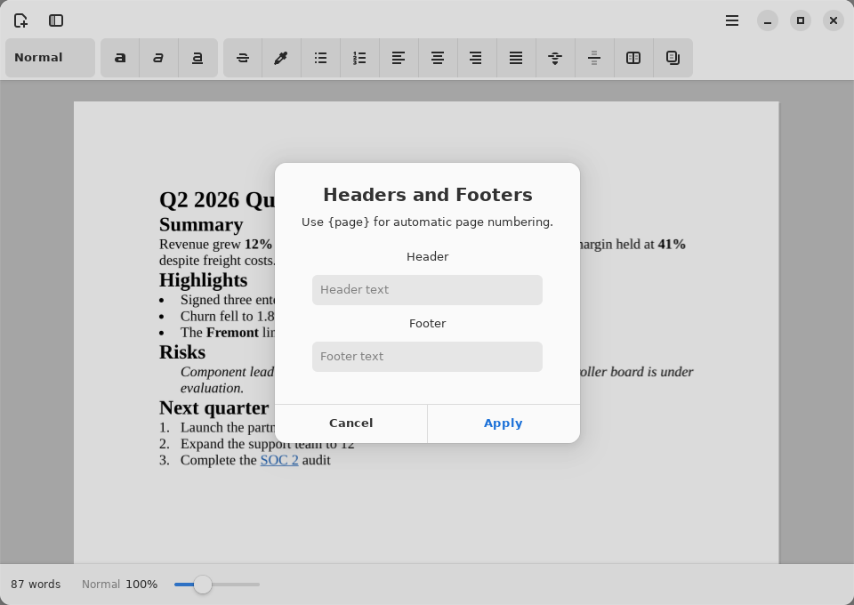

**Edit Headers and Footers…** sets the text at the top and bottom of every
page; `{page}` becomes the page number.

## Dark style

*Dark style follows the desktop; the page stays paper-white.*

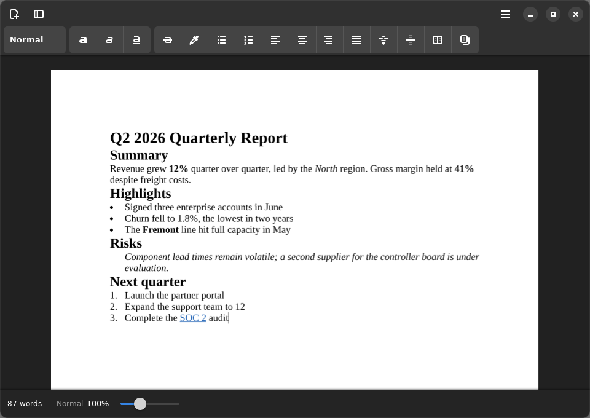

## Also in Letters

Without a screenshot of their own:

- **Footnotes** (Ctrl+Alt+F), **page breaks** (Ctrl+Return), **links**
  (Ctrl+Shift+K) and **images**.
- **Page Setup** (Ctrl+Shift+L): paper size, orientation and margins.
  **Print**, **Print Preview**, and **Export as PDF** (also through Typst).
- **Distraction-free typing** (Ctrl+Alt+D): the bars slide away while you
  type and come back when the pointer moves.
- The **ruler** (Ctrl+Shift+R), **columns**, **line spacing**, alignment,
  highlight and strikethrough.
- **Crash recovery**: unsaved work is snapshotted and offered back after a
  crash ([recovery.md](../readiness-2026-09/recovery.md)).

## Gaps these screenshots show

The screenshots show these problems as they are now. They are recorded
here rather than hidden:

- **Tab in a table cell types a tab** instead of moving to the next cell,
  so a row has to be filled by clicking each cell.
- The **Comments** view's sidebar tab icon is missing (it shows the
  broken-image placeholder).
- The comment author is the system login name (`root` in a container),
  not a display name.
- Real-world DOCX/ODT files can look much worse than this demo; the
  [render parity roadmap](../RENDER-PARITY-ROADMAP.md) tracks that.
