# Tables

A spreadsheet. Opens XLSX, XLS, ODS, CSV and TSV; saves XLSX and exports
PDF. Formulas are calculated by IronCalc. Pre-alpha: see
[the README](../../README.md#project-status) before relying on it.

Every screenshot is of the running app, captured by
`tests/gui/feature_tour.py` ([how](README.md#how-the-screenshots-are-made)).

## The grid and live statistics

*A workbook with formulas; selecting a range shows its Sum, Average and Count.*

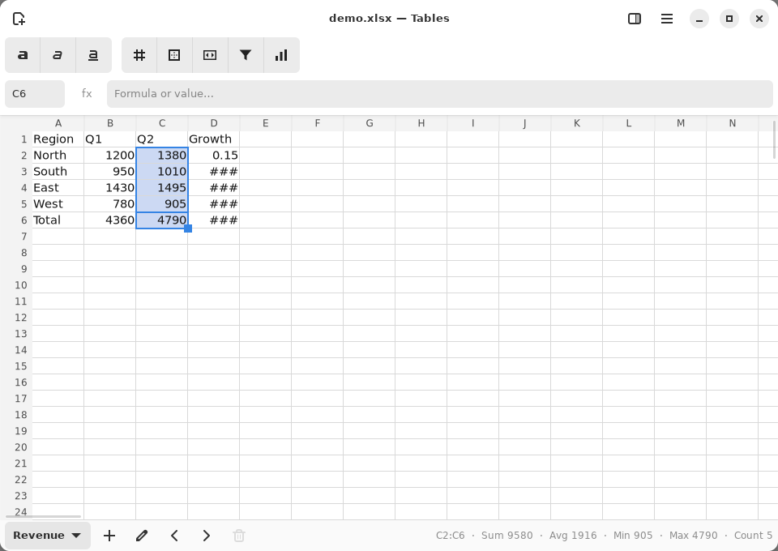

The name box (top left) shows the active cell, and the fx bar shows its
contents or formula. Selecting a range puts its Sum, Average, Min, Max and
Count in the status bar, counting only rows that are shown. **Ctrl+G**
jumps to a cell or a named range.

## Formula autocomplete

*Typing a function name offers the functions it could be, with their signatures.*

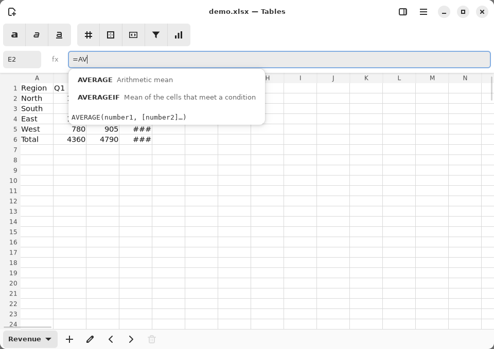

As you type a function name, the formula bar offers the matching
functions with a one-line description. **Tab** inserts the chosen one
with its parenthesis, and inside the call its signature is shown.

## The Format sidebar

*The Format sidebar: font, fill, borders, alignment and number format for the selection.*

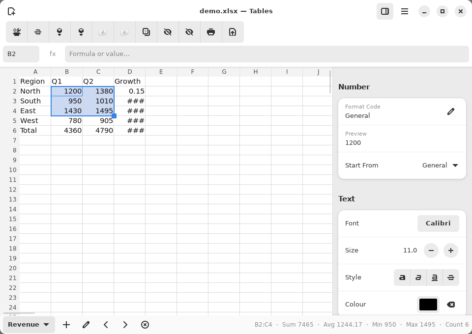

The **Format** button (top right) opens the sidebar for the selected
cells. Each change applies to the whole selection as one undo step, and
the sidebar follows the selection as it moves.

## Sort and filter from the column menu

*Alt+Down on a cell opens its column's menu: sort, and filter by value.*

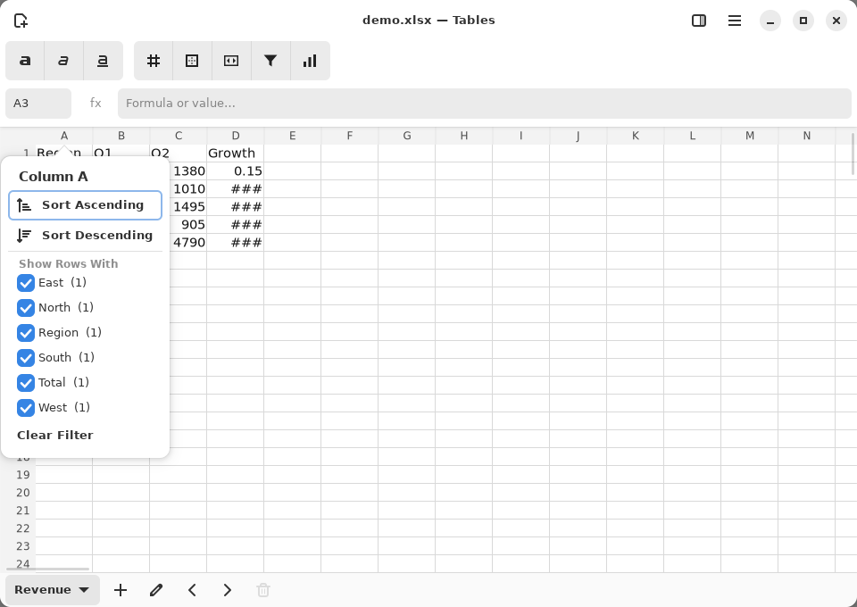

**Alt+Down** on a cell, or a right-click on a column header, opens the
column's menu: Sort Ascending / Descending, and a checklist of the
column's values (each with its row count). Unticking a value hides its
rows; **Clear Filter** shows them again. Each change is one undo step.

## Charts

*Insert Chart: the active cell's column against the labels in column A, previewed in each kind.*

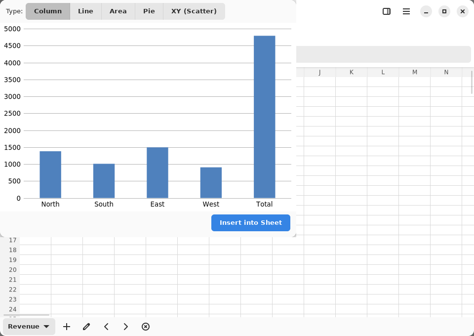

**Insert Chart…** charts the active cell's column, using column A as the
labels. It previews the chart as Column, Line, Area, Pie or XY (Scatter)
before **Insert**.

## Conditional formatting

*Conditional formatting: colour cells by a rule on their value.*

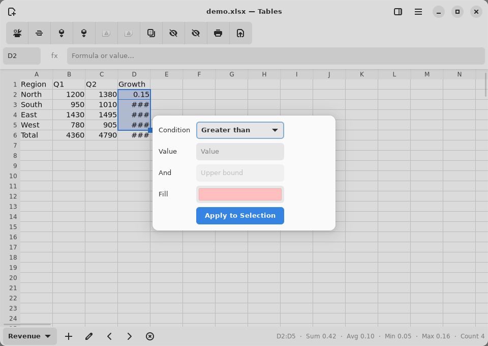

**Conditional Formatting…** colours the selected cells that meet a rule
(greater than, less than, equal to, or between two values) in the fill you choose.

## Number formats

*Number formats: built-in kinds or a custom format code, previewed on the cell.*

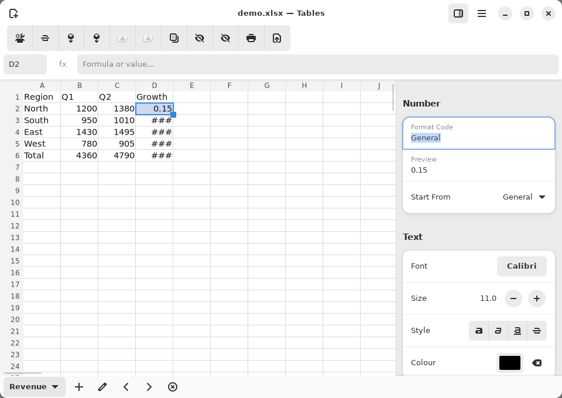

**Ctrl+Shift+F** opens the number format in the Format sidebar. Start
from a built-in kind, or edit the format code directly; the preview shows
the active cell's value in that format.

## Named ranges

*Named ranges: name a range, then jump to it or use it in formulas.*

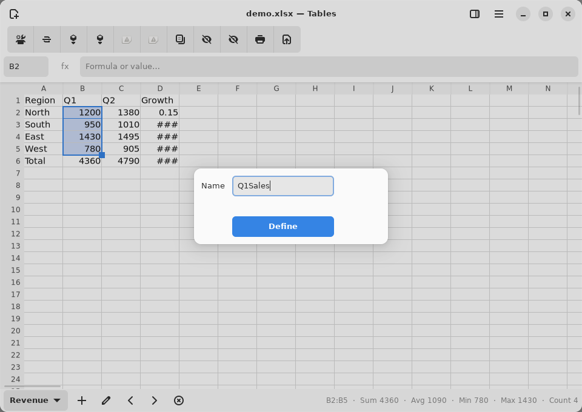

**Define Name…** names the selected range. The name then works in the
name box (type it to jump there) and in formulas.

## Notes

*Notes on cells, shown on hover and read out by screen readers.*

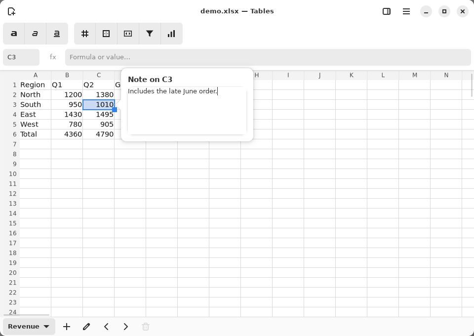

**Shift+F2** (or Ctrl+Alt+C) writes a note on the active cell. A noted
cell shows the note on hover, and screen readers read it as the cell's
description. Notes are saved in the XLSX.

## Several sheets

*Several sheets: add, rename, reorder and delete them from the sheet bar, all undoable.*

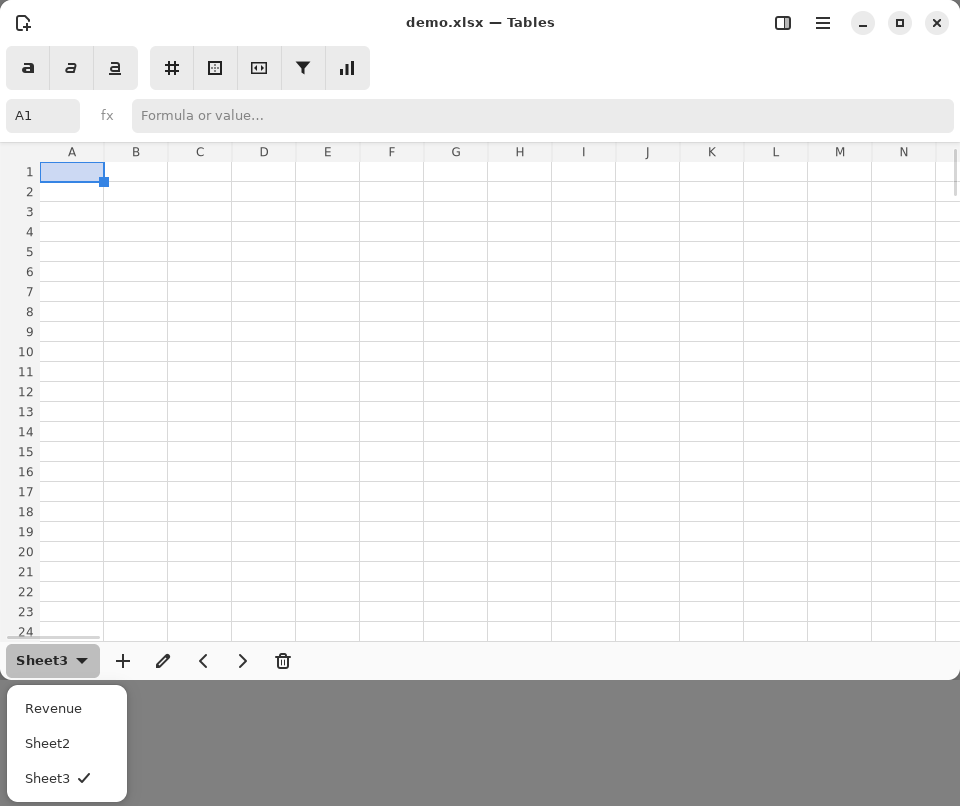

The sheet bar at the bottom adds, renames, moves and deletes sheets, and
its switcher lists them all. Each of those is one undo step, deleting a
sheet included. Formulas that refer to another sheet keep working when it
is renamed.

## Dark style

*Tables in the dark style.*

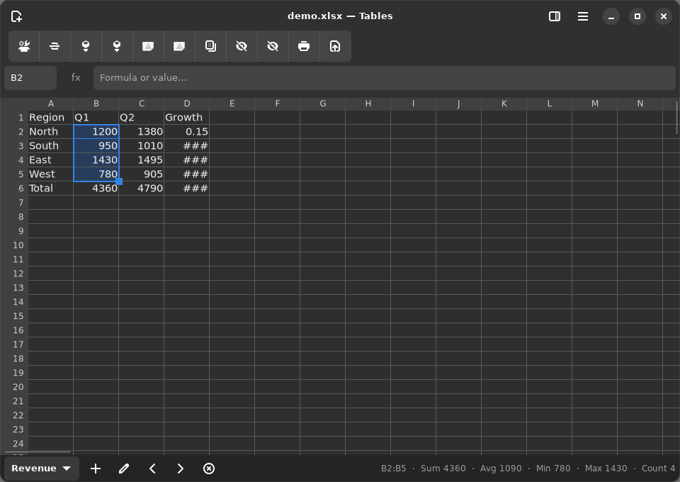

## Also in Tables

Without a screenshot of their own:

- **Fill handle**: drag the square at the selection's corner to repeat a
  value or continue a series.
- **Merge cells**, **cell borders**, **hide/unhide rows and columns**.
- **Data validation lists**: a cell with a list offers it on Alt+Down.
- **Page setup**, **print areas**, **Export as PDF**.
- **Opening without overwriting**: CSV, TSV, ODS and XLS open, but Ctrl+S
  never writes over them. Tables says it cannot save in that format and
  offers Save As with the same name as `.xlsx`.
- **Crash recovery**: unsaved work is snapshotted and offered back after a
  crash.

## Gaps these screenshots show

The screenshots show these problems as they are now. They are recorded
here rather than hidden:

- **Long numbers show `###`** (column D) where LibreOffice would round the
  value to fit the column.
- **Two toolbar buttons have no icon** (the fifth and sixth show the
  broken-image placeholder).
- **Insert Chart charts only the active cell's column**, and does nothing
  at all, with no message, when that column has no numbers. It also
  includes a totals row as if it were data (the "Total" bar).
- On a desktop without a window manager the chart dialog opens detached
  in the top-left corner. Under GNOME it is an ordinary dialog.
